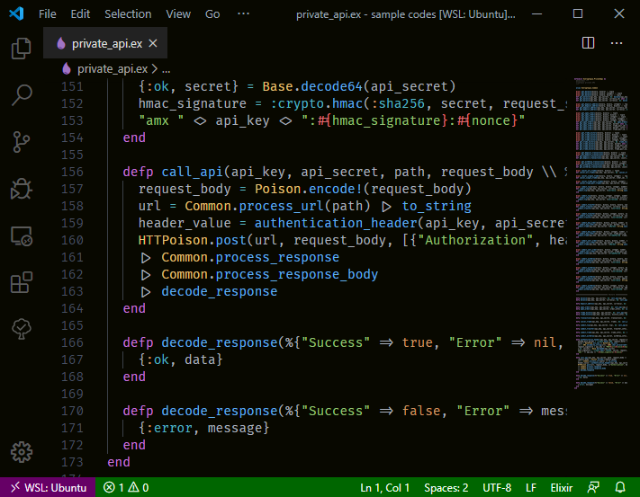
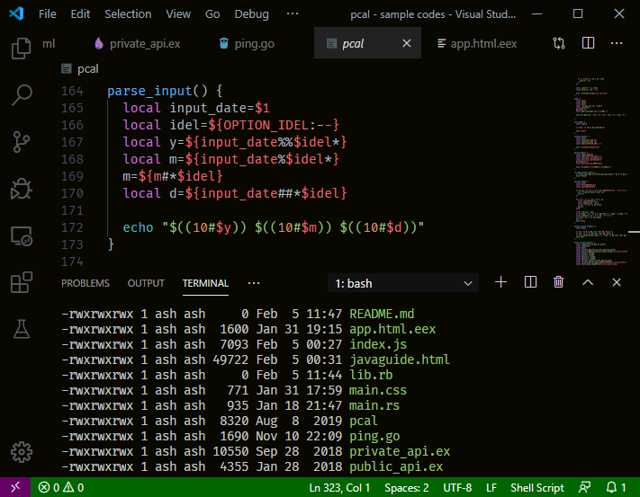

# Darker One
A darker theme with fewer borders based on [One Dark Pro](https://github.com/Binaryify/OneDark-Pro) for VS Code.

## Screenshots

 Modification indicators with `"workbench.editor.highlightModifiedTabs": true`.

## License
[MIT License](LICENSE)
